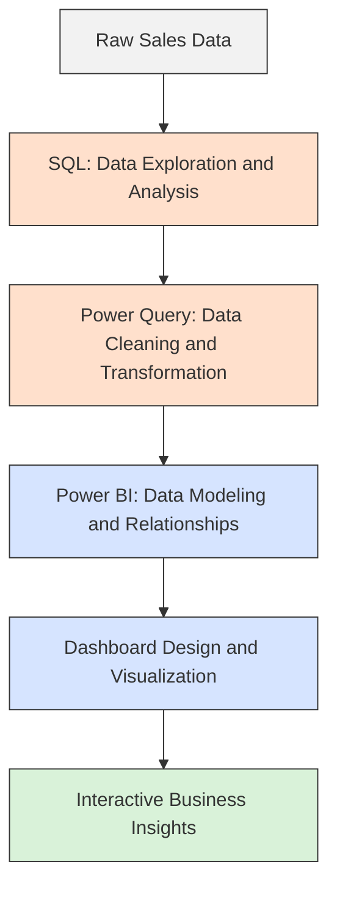
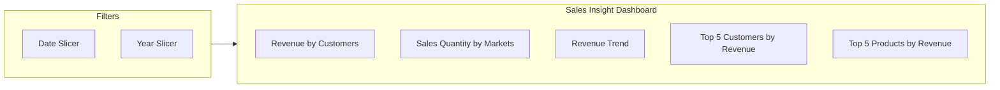

# Business Sales Insight

### Turning Raw Sales Data into Actionable Business Decisions

---

## Table of Contents

- [Overview]
- [Dashboard Preview]
- [Objective]
- [Workflow]
- [Process]
- [Key Insights]
- [Dashboard Features]
- [Tools Used]
- [Files in this Repository]
- [Conclusion]

---

## Overview

This project focuses on analyzing customer sales data to uncover trends, patterns, and key business insights across different regions and customer segments. Raw sales data was first explored and queried using MySQL, then cleaned, transformed, and structured using Power BI Query Editor to prepare it for analysis and reporting. The final output is an interactive Power BI dashboard that presents sales performance across various segments in a clear, visual, and decision-friendly format.

## Dashboard Preview

## Objective

The goal of this project was to help understand overall sales performance by breaking down revenue and sales quantity across customers, markets, products, and time periods, enabling faster and more informed business decisions.

## Workflow

The project follows a simple end-to-end pipeline, from raw data to the final interactive dashboard.

## Process

### 1. Data Analysis with SQL
- Queried the customer sales dataset using MySQL to identify initial trends and patterns.
- Explored revenue and sales quantity distribution across regions and customer segments.
- Validated and cross-checked key figures before moving the data into Power BI.

### 2. Data Cleaning and Transformation
- Cleaned and structured the raw dataset using Power Query in Power BI.
- Handled inconsistencies, removed redundant fields, and formatted data types for accurate reporting.
- Prepared relationships between tables to support dynamic filtering and analysis.

### 3. Dashboard Design (ETL and Visualization)
- Designed an interactive dashboard in Power BI to visualize sales performance.
- Added slicers for date and year to allow dynamic, time-based filtering.
- Built visuals to track revenue and sales quantity by customer, market, and product.

## Key Insights

- Total revenue tracked was approximately 984.81M, with a combined sales quantity of 2M units.
- Delhi NCR emerged as the top-performing market in both revenue and sales quantity.
- Electricalsara Stores was the leading customer by revenue, contributing significantly more than other top accounts.
- The Revenue Trend chart highlights seasonal fluctuations in performance from 2017 through 2020.
- Own Brand and Distribution categories together formed a major share of product-wise revenue.

## Dashboard Features

- **Revenue by Customers:** Bar chart ranking customers by total revenue contribution.
- **Sales Quantity by Markets:** Bar chart comparing sales quantity across different markets.
- **Revenue Trend:** Line chart showing monthly revenue movement over multiple years.
- **Top 5 Customers by Revenue:** Highlights the highest revenue-generating customers.
- **Top 5 Products by Revenue:** Highlights the best-performing products by revenue.
- **Date and Year Slicers:** Allow filtering the dashboard by specific months or years for focused analysis.

## Tools Used

- **MySQL** – for querying and initial data analysis
- **Power BI** – for data transformation, modeling, and dashboard design
- **Power Query** – for data cleaning and structuring

## Files in this Repository

- `Sales_Insights.pbix` – Power BI project file containing the complete dashboard and data model
- `README.md` – Project documentation

## Conclusion

This project demonstrates how SQL and Power BI can be combined to turn raw sales data into meaningful, easy-to-understand business insights, supporting better decision-making through clear and interactive visualizations.
